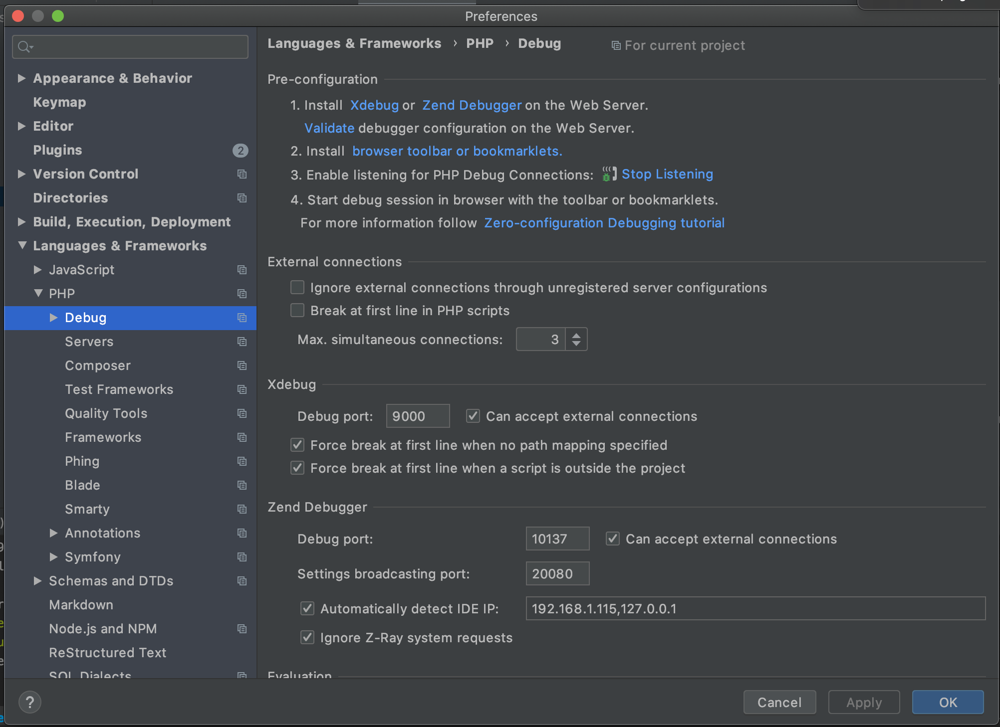
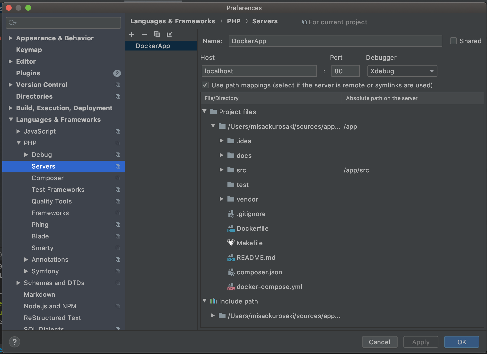
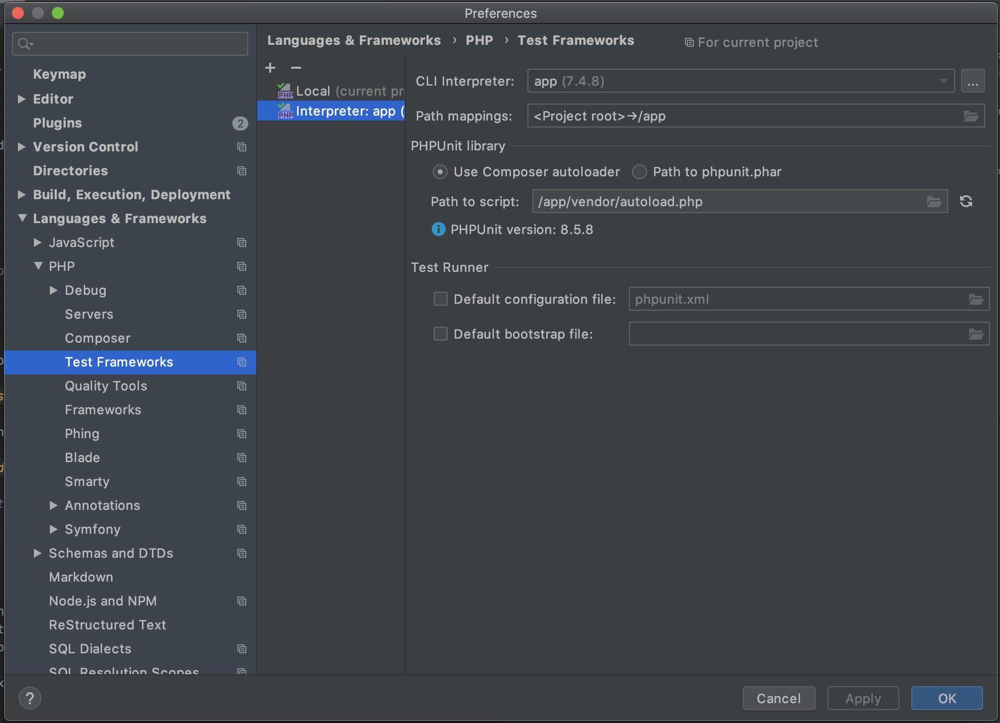
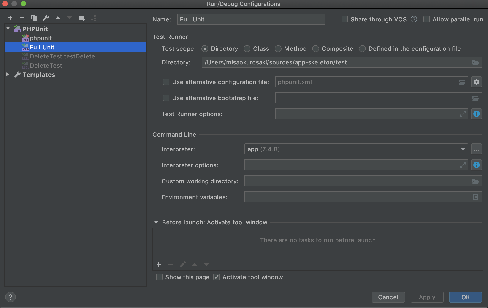

# Dependency injector container
Dependency injector container for educational purposes using the standard PSR-11: https://www.php-fig.org/psr/psr-11/

# Installation

Execute `make build` to download Docker container and install all composer dependencies.

### Enabling  xdebug in PhpStorm

The xdebug port is defined in the `docker-compose.yml`:
``` yaml
services:
  app:
    build: .
    volumes:
      - ./:/app
    working_dir: /app
    ports:
      - 9001:9000
```

In this case, use port `9000` in the PhpStorm config:



Then, we need to configure servers and how to accept xdebug connections & mappings: 



### Enabling phpUnit in PhpStorm

First create a remote interpret for `phpUnit` referencing the Docker container 



Then, on the IDE top dropdown select `Edit configuration` and create a new one called `Full Unit`:



# Basic usage

Once project is downloaded, we will execute:
- `make start` to start the container.
- `make stop` to stop the container.

For more actions, execute `make` without arguments.

# TODO:
- [X] No troba ID ni autowire (ara espera excepcio per no trobar la ID, i hauria de ser per no trobar la class)
- [X] Sense autowire, ni parametres
- [X] Sense autowire, amb parametre normal
- [X] Sense autowire, amb la class key faltant
- [X] Ssense autowire, amb referencia circular
- [X] Sense autowire, no troba parametres
- [X] Sense autowire, amb parametre a altra dependencia
- [X] Amb autowire, amb parametre normal
- [ ] Amb autowire, amb parametre a altra dependencia sense autowire

-------

- [x] dependencia conocida sin constructor -> fallo -> no falla, sempre hi ha constructor per defecte, vol dir que no te parametres
- [ ] dependencia conocida con constuector -> amb parametres i sense
    - [ ] parametro desconocid -> autow
    - [ ] parametro desconocido no existente -> autowire falla
    - [x] parametro conocido

- [ ] dependencia desconocida sin consturctor -> falla -> no deberia
- [ ] dependencia desconocida con constructor -> puede tener parametros o no
    - [ ] parametro concocido -> deberia cargarlo
    - [ ] parametro desconocido -> deberia usar autowire
    - [ ] parametro desconocido no existente -> autowire falla